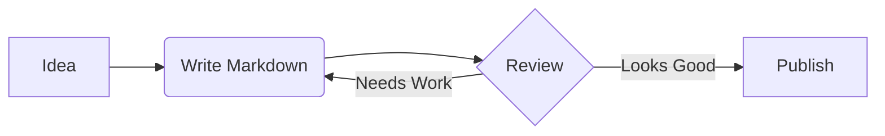

<span id="top" />

<div align="center">
<br><br>
<h1>
<a href="#"></a>
<br>
Ultimate Markdown Cheat Sheet
<br><br>
</h1>
<h3>Your friendly, comprehensive, and beautiful guide to Markdown syntax.</h3>
<br><br>
</div>

<span id="table-of-contents"></span>

## Table of Contents<a href="#table-of-contents"></a>

-   [**Basic Formatting**](#basic-formatting) – Headings, Bold, Italic, etc.
-   [**Lists & Tasks**](#lists-tasks) – Unordered, Ordered, Task Lists
-   [**Links & Media**](#links-media) – URLs, Images, Anchors
-   [**Quotes & Code**](#quotes-code) – Blockquotes, Inline Code, Code Blocks, Escaping
-   [**Structure**](#structure) – Tables, Horizontal Rules
-   [**Advanced & GFM Features**](#advanced-gfm-features) – Alerts, Mermaid, Math, HTML

<span id="limited-support"></span>

> Features with limited support across different Markdown parsers are marked with **[[L]](#limited-support)**.

<br>
<br>
<br>

<span id="basic-formatting"></span>

## Basic Formatting<a href="#basic-formatting"></a>

<br>

### Headings

Headings help structure your document. Use `#` for levels 1-6.

# Header 1

## Header 2

### Header 3

#### Header 4

##### Header 5

###### Header 6

<br>

```markdown
# Header 1
## Header 2
### Header 3
#### Header 4
##### Header 5
###### Header 6
```

<br>

### Emphasis & Styling

Make your text stand out with basic formatting.

**Bold Text**: Space is **vast and empty**.<br>
*Italic Text*: The stars are *beautifully bright*.<br>
***Bold & Italic***: The universe is ***constantly expanding***!<br>
~~Strikethrough~~: Pluto is ~~a major planet~~ a dwarf planet.

```markdown
**Bold Text**: Space is **vast and empty**.
*Italic Text*: The stars are *beautifully bright*.
***Bold & Italic***: The universe is ***constantly expanding***!
~~Strikethrough~~: Pluto is ~~a major planet~~ a dwarf planet.
```

<br>

### Escaping Characters

If you want to type symbols like `*` or `_` without triggering formatting, use a backslash `\`.

\*This text will not be italicized.\*

```markdown
\*This text will not be italicized.\*
```

<br>
<br>
<br>

<span id="lists-tasks"></span>

## Lists & Tasks<a href="#lists-tasks"></a>

<br>

### Unordered Lists

Use `*`, `-`, or `+` for bullet points.

*   Launch preparations
*   Engine check
    -   Fuel levels nominal
    -   Thrusters engaged
*   Liftoff!

```markdown
*   Launch preparations
*   Engine check
    -   Fuel levels nominal
    -   Thrusters engaged
*   Liftoff!
```

<br>

### Ordered Lists

Use numbers followed by periods.

1.  Learn Markdown
2.  Write awesome documentation
3.  Profit!
    1.  Celebrate with coffee
    2.  Share with friends

```markdown
1.  Learn Markdown
2.  Write awesome documentation
3.  Profit!
    1.  Celebrate with coffee
    2.  Share with friends
```

<br>

### [[L]](#limited-support) Task Lists

Keep track of your to-dos.

-   [x] Write cheat sheet
-   [x] Add friendly examples
-   [ ] Conquer the galaxy

```markdown
-   [x] Write cheat sheet
-   [x] Add friendly examples
-   [ ] Conquer the galaxy
```

<br>
<br>
<br>

<span id="links-media"></span>

## Links & Media<a href="#links-media"></a>

<br>

### Links

A simple automatic link: <https://www.markdownguide.org>  
An email link: <hello@universe.com>  
A formatted [link to GitHub](https://github.com "Visit GitHub") with hover text.

```markdown
A simple automatic link: <https://www.markdownguide.org>
An email link: <hello@universe.com>
A formatted [link to GitHub](https://github.com "Visit GitHub") with hover text.
```

<br>

### Anchor Links

Jump to [Basic Formatting](#basic-formatting) or jump to a <span id="custom-anchor">custom hidden anchor</span>.

```markdown
Jump to [Basic Formatting](#basic-formatting) or jump to a <span id="custom-anchor">custom hidden anchor</span>.
```

<br>

### Images


```markdown

```

For a specific size, you can use HTML:


```markdown

```

<br>
<br>
<br>

<span id="quotes-code"></span>

## Quotes & Code<a href="#quotes-code"></a>

<br>

### Blockquotes

Great for citing text or drawing attention.

> "To infinity, and beyond!"
> — Buzz Lightyear

Nested quotes:
> First level of quoting
> > Second level of quoting

```markdown
> "To infinity, and beyond!"
> — Buzz Lightyear

Nested quotes:
> First level of quoting
> > Second level of quoting
```

<br>

### Inline Code

Use backticks for inline code, like `print("Hello!")` or representing keystrokes.

```markdown
Use backticks for inline code, like `print("Hello!")` or representing keystrokes.
```

<br>

### Code Blocks

Use triple backticks for syntax highlighting.

```python
def greet_user(name: str):
    """A friendly greeting function."""
    print(f"Hello, {name}! Welcome aboard.")
```

````markdown
```python
def greet_user(name: str):
    """A friendly greeting function."""
    print(f"Hello, {name}! Welcome aboard.")
```
````

<br>

### Escaping Backticks

To include backticks inside code formatting, wrap the code with more backticks than it contains.

Inline escaping: `` `inline` ``

Block escaping:

````markdown
```python
print("Hello")
```
````

<br>

`````markdown
Inline escaping: `` `inline` ``

Block escaping:

````markdown
```python
print("Hello")
```
````
`````

<br>
<br>
<br>

<span id="structure"></span>

## Structure<a href="#structure"></a>

<br>

### Tables

Organize data easily. Colons `:` dictate alignment.

| Feature       | Status     | Alignment |
| :------------ | :--------: | --------: |
| Markdown      | Awesome    | Left      |
| Tables        | Useful     | Center    |
| Formatting    | Clean      | Right     |

```markdown
| Feature       | Status     | Alignment |
| :------------ | :--------: | --------: |
| Markdown      | Awesome    | Left      |
| Tables        | Useful     | Center    |
| Formatting    | Clean      | Right     |
```

<br>

### Horizontal Rules

Separate content using three or more hyphens, asterisks, or underscores.

---

***

___

<br>

```markdown
---

***

___
```

<br>
<br>
<br>

<span id="advanced-gfm-features"></span>

## [[L]](#limited-support) Advanced & GFM Features<a href="#advanced-gfm-features"></a>

<br>

### Alerts / Callouts

> [!NOTE]
> Markdown is incredibly versatile for daily documentation.

> [!TIP]
> Use a good editor with preview mode to spot formatting errors early!

> [!IMPORTANT]
> The exact rendering of these alerts depends entirely on the platform (e.g., GitHub).

> [!WARNING]
> Too much styling can make raw markdown hard to read.

> [!CAUTION]
> Deleting your documentation might lead to sad developers.

```markdown
> [!NOTE]
> Markdown is incredibly versatile for daily documentation.

> [!TIP]
> Use a good editor with preview mode to spot formatting errors early!

> [!IMPORTANT]
> The exact rendering of these alerts depends entirely on the platform (e.g., GitHub).

> [!WARNING]
> Too much styling can make raw markdown hard to read.

> [!CAUTION]
> Deleting your documentation might lead to sad developers.
```

<br>

### Collapsible Sections

Keep large chunks of info hidden until needed.

<details>
  <summary>Click to reveal secret coordinates</summary>
  
  42° 21' 36" N, 71° 3' 35" W
</details>

<br>

```markdown
<details>
  <summary>Click to reveal secret coordinates</summary>
  
  42° 21' 36" N, 71° 3' 35" W
</details>
```

<br>

### Footnotes

Add references or extra context without cluttering the text.

Here is a statement that needs clarification[^1].

[^1]: This is the clarification, tucked away neatly at the bottom.

```markdown
Here is a statement that needs clarification[^1].

[^1]: This is the clarification, tucked away neatly at the bottom.
```

<br>

### Keyboard Input

Press <kbd>Ctrl</kbd>+<kbd>S</kbd> to save your work.

```markdown
Press <kbd>Ctrl</kbd>+<kbd>S</kbd> to save your work.
```

<br>

### Subscript & Superscript

Water is H<sub>2</sub>O and E = mc<sup>2</sup>.

```markdown
Water is H<sub>2</sub>O and E = mc<sup>2</sup>.
```

<br>

### Ruby Text

<ruby>漢字<rt>Kanji</rt></ruby>

```markdown
<ruby>漢字<rt>Kanji</rt></ruby>
```

<br>

### Math Equations

For platforms supporting KaTeX/MathJax.

Inline math: $E = mc^2$

Block math:
$$ \int_{-\infty}^{\infty} e^{-x^2} dx = \sqrt{\pi} $$

<br>

```markdown
Inline math: $E = mc^2$

Block math:
$$ \int_{-\infty}^{\infty} e^{-x^2} dx = \sqrt{\pi} $$
```

<br>

### Mermaid Diagrams

Generate charts right from code!



````markdown

````

<br>

### CSS Styling

You can inject raw HTML/CSS into Markdown if supported.

<span style="font-size: 2em; font-weight: bold; background: linear-gradient(90deg, #F76, #F67, #F7A, #A7F, #67F); -webkit-background-clip: text; -webkit-text-fill-color: transparent;">Rainbow Text!</span>

```markdown
<span style="font-size: 2em; font-weight: bold; background: linear-gradient(90deg, #F76, #F67, #F7A, #A7F, #67F); -webkit-background-clip: text; -webkit-text-fill-color: transparent;">Rainbow Text!</span>
```

<br>

### Definition Lists

Some parsers support definition lists.

Markdown
: A lightweight markup language with plain-text-formatting syntax.
HTML
: The standard markup language for documents designed to be displayed in a web browser.

```markdown
Markdown
: A lightweight markup language with plain-text-formatting syntax.
HTML
: The standard markup language for documents designed to be displayed in a web browser.
```

<br><br>
<br><br>
<br><br>
<br><br>

---

✨ Always creating more cool stuff for you! ✨ —⠀[**XulbuX**](https://xulbux.com)
